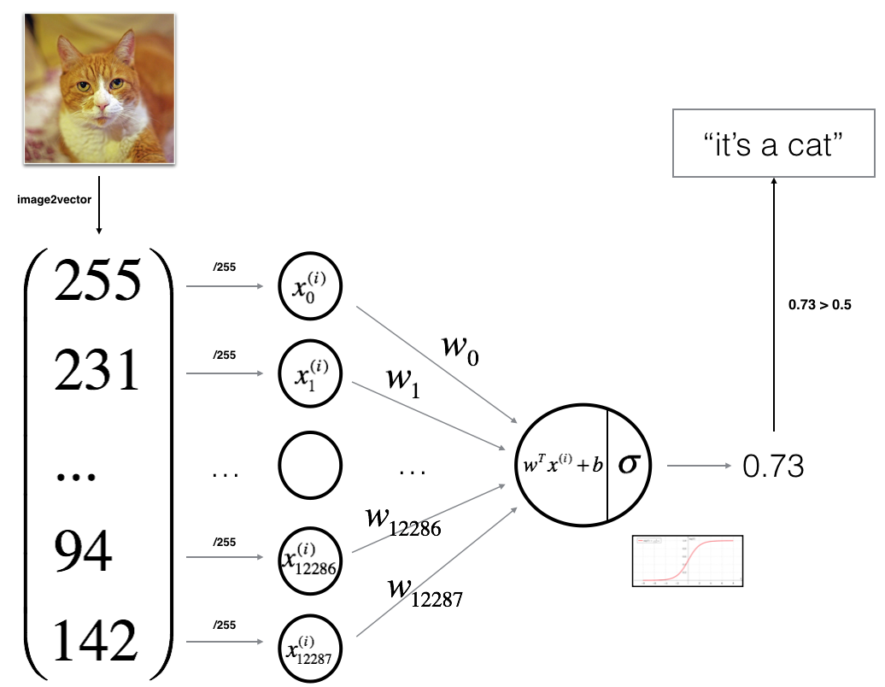

# Cat - Non Cat Classifier

This is a logistic regression classifier to recognize cats and non cat images. I have done this with a neural network mindset. 
This classifier is trained on the data set provided by coursera in the specialization course of Deep Learning and Neural Networks.

</img>

### How the classifier is built ? 

- Initialize the parameters of the model
- Learn the parameters for the model by minimizing the cost  
- Used the learned parameters to make predictions (on the test set)
- Analyse the results and conclude

